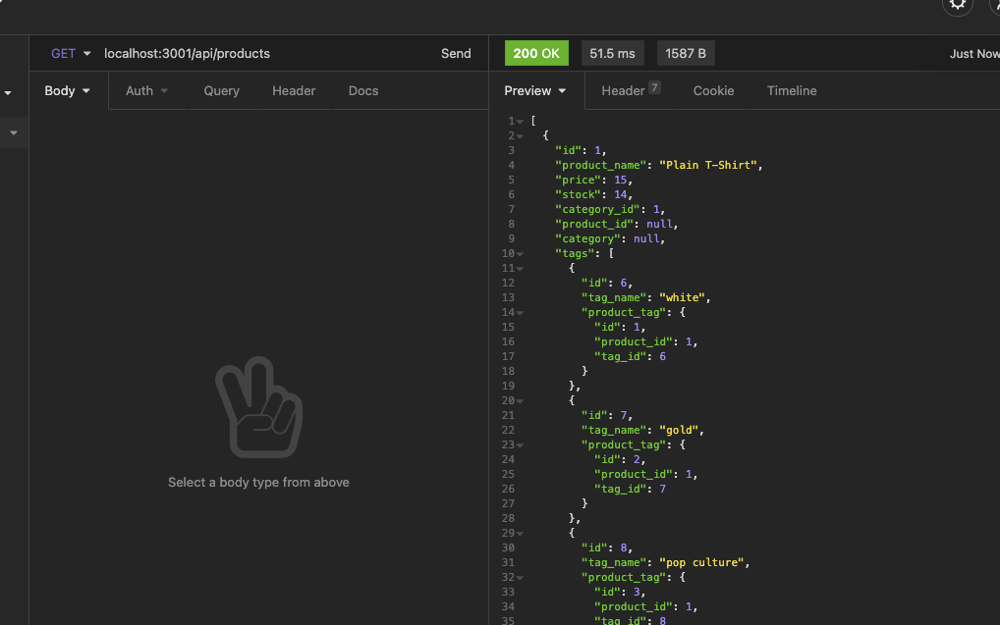
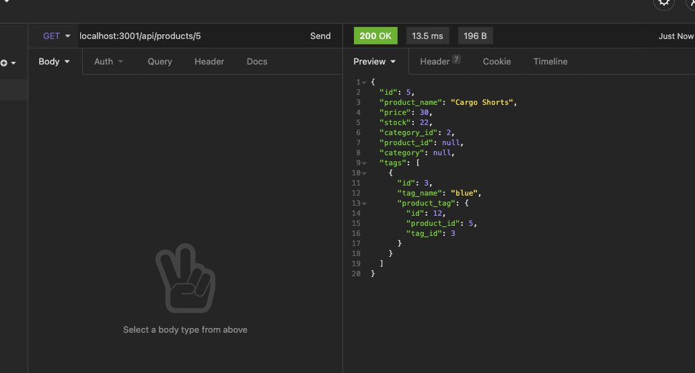
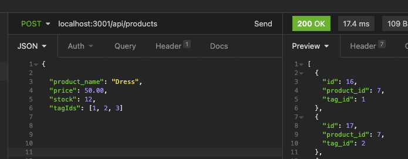
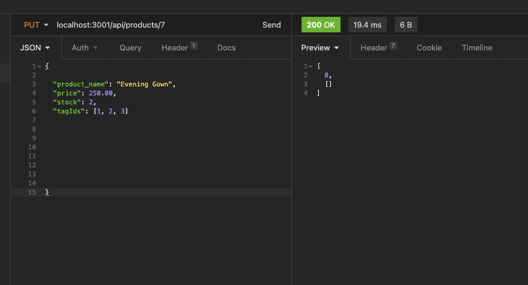
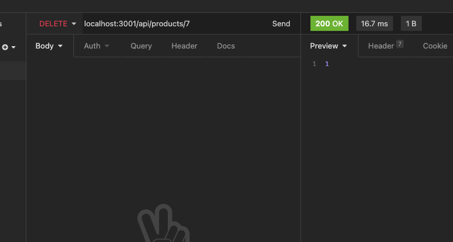
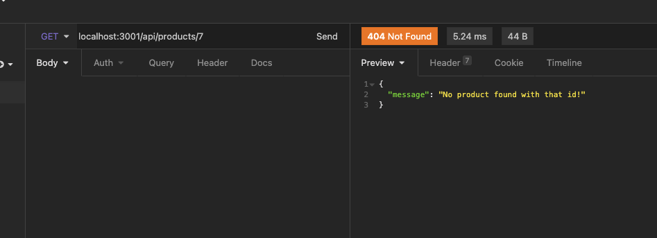

# E-Commerce-Backend

[](https://opensource.org/licenses/ISC)

## Table of Contents
[Technologies Used](#Technologies-Used)<br>
[Installation](#Installation)<br>
[User Story](#User-Story)<br>
[Acceptance Criteria](#Acceptance-Criteria)<br>
[Images](#Images)<br>
[Demo](#Demo)<br>
[Contact](#Contact)<br>

## Technologies Used
        Javascript
        Node.js
        Express.js
        Sequelize
        MySQL
        Insomnia Core
        
## Installation

To install dependencies run the following command: 

    npm i
To seed MySQL database with data, navigate to the root directory and run the following command: 
    
    node seeds/

To run e-commerce-backend run the following command: 
   
    npm start

## User Story    
    AS A manager at an internet retail company
    I WANT a back end for my e-commerce website that uses the latest technologies
    SO THAT my company can compete with other e-commerce companies

## Acceptance Criteria
```md
GIVEN a functional Express.js API
WHEN I add my database name, MySQL username, and MySQL password to an environment variable file
THEN I am able to connect to a database using Sequelize
WHEN I enter schema and seed commands
THEN a development database is created and is seeded with test data
WHEN I enter the command to invoke the application
THEN my server is started and the Sequelize models are synced to the MySQL database
WHEN I open API GET routes in Insomnia Core for categories, products, or tags
THEN the data for each of these routes is displayed in a formatted JSON
WHEN I test API POST, PUT, and DELETE routes in Insomnia Core
THEN I am able to successfully create, update, and delete data in my database
```


## Images









## Demo

[Link to Video Demo](https://drive.google.com/file/d/1b5W4CUWSaxEbd8lMTE6T-lYizcAAUdET/view)

[Github Repo Link](https://github.com/johnsoncm/e-commerce-backend)

## Contact

Please contact me at johnsoncm3@gmail.com or visit [johnsoncm](https://www.github.com/johnsoncm) for any questions or comments.
